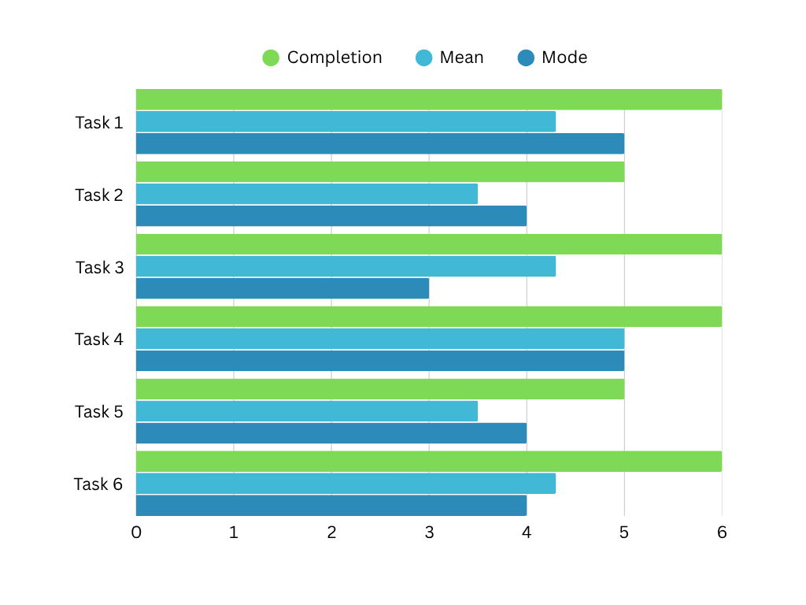

# Phase III: Prototypes and User Testing

## Introduction

In Phase III, our team conducted a user study to test the usability of our SmartInsulin mobile application prototype. The prototype was refined based on insights from the earlier phases, and this final evaluation focused on how well users could navigate its core features. We observed how participants interacted with the prototype in simulated real-world scenarios, with the goal of identifying areas for improvement before finalizing the design.

## Methods

To evaluate the usability of our SmartInsulin prototype, we conducted a structured user study simulating realistic scenarios for individuals managing Type 2 diabetes. The purpose of the study was to identify usability strengths and pain points across key features of the interface, interactions, and flows, such as setup, data sharing, note logging, trend analysis, and caregiver support.

This was a formative usability study, designed to inform design decisions while the prototype is still evolving. We used the think-aloud protocol, where participants verbalized their thoughts, reactions, and confusion while performing tasks. This method allowed us to gain insight into user decision-making, expectations, and perceptions of ease-of-use.

Each user was first presented an [Informed Consent Form](SmartInsulin%20User%20Study%20Protocol.pdf), given ample time to review and ask any questions, and the study proceeded only once the user had signed the consent form.

The study included three parts:

1. Preliminary questions to understand user background and expectations, which forked into two separate paths based on each user's answer to the initial question
2. Six task-based scenarios that reflect real-world use cases of the SmartInsulin app
3. Post-task questions in which participants were asked to reflect on their experience with the prototype

Task 1 aimed to test the onboarding experience, clarity of instructions, and overall ease of initial configuration.\
Task 2 aimed to evaluate the discoverability and usability of the export/share feature, as well as trust in the report’s formatting.\
Task 3 aimed to assess flexibility in logging contextual information and the intuitiveness of manual input.\
Task 4 aimed to examine the usability and usefulness of AI-driven interaction, as well as trust in health-related answers.\
Task 5 aimed to evaluate the readability of data visualizations, the layout of insights, and user comprehension of trends.\
Task 6 aimed to test multi-user support, caregiver access, and clarity of information in a remote monitoring context.

We recorded participants’ behavior, task success, and post-task feedback, including:
- Comments users offered as they were thinking aloud
- Whether they completed the task
- A self-reported difficulty score (1 = Very Difficult, 5 = Very Easy)
- Open-ended responses explaining their experience

The post-task debrief questions helped us identify unmet expectations, areas for improvement, and overall user sentiment.

For the specific copy of the protocol followed over the course of the user study, please see the [protocol document](https://github.com/ChicoState/smartinsulin-ux/blob/main/phaseIII/SmartInsulin%20User%20Study%20Protocol.pdf).

Our software engineering team also solicited feedback from the software engineering class (n = 35, approximately) during a demonstration of the application.

## Findings
### User Study
The full collection of data from this user study can be found in the following [spreadsheet](https://docs.google.com/spreadsheets/d/1oINi5R7GugN7KuO-_0Xp0-A-QpbCyS-iFTeI-r4qcZ0/edit?usp=sharing).

#### __Background:__
67% (4 of 6) users had no previous experience managing diabetes. The two users who had some experience managing diabetes monitored for a family member, who instructed them on what to do, and had no experience with diabetes-related applications. Two of the four users who had no previous experience managing diabetes had a basic understanding of the condition and could theorize at some of the challenges diabetics may face in monitoring their condition.

Two users proposed (response to NO – c) that blood-sugar-related concerns as a major point of concern for diabetics. Four users suggested alerts and/or reminders as a feature of a diabetes management app. Three users cited reviews or other trustworthy sources for recommendation as a point of trustworthiness-determination for an application.\

#### __Tasks:__
100% (6 of 6) of our six-user sample completed task one. The mode of the 1-5 rating of the task was 5, with the mean coming out to 4.3, and a standard deviation of 0.8. User feedback trended toward an appreciation for the linear nature of the sign-up process.

83% (5 of 6) users completed task two. The user who did not successfully complete the task rated the task a 2, while the task mode was 4, the mean was 3.5, and the standard deviation was 0.7. No two users followed the same interaction path to complete the task. User feedback trended toward indicating that a flaw in the prototype (the ‘Export to PDF’ button being “greyed out”) made them believe that another action needed to be completed prior to being able to utilize that button.

100% (6 of 6) of our six-user sample completed task three. The mode of the 1-5 rating of the task was 3, the mean was 4.3, and the standard deviation was 0.4. User feedback tended toward users expecting a text field, which was not present in the prototype. User feedback also tended toward users seeking out a “log” or “notes” label in the prototype. Users expressed a desire for clearer labeling directing them toward the correct part of the app.

100% (6 of 6) of our six-user sample completed task four. Both the mean and mode of the 1-5 rating scale were 5, and consequentially the standard deviation was 0. Users indicated the chatbot button’s isolation on the home screen made it easy to identify, and from there the interaction was, as users identified, straight-forward. One user remarked on privacy concerns regarding a chatbot within the application, and would prefer to do searching outside of the application.

83% (5 of 6) users completed task five. The user who did not successfully complete the task rated the task a 1, while the task mode was 4, the mean was 3.5, and the standard deviation was 1.4. Two users noted the graph icon to be assistive in helping them identify the correct course of action. Four users clicked directly from the dashboard/home page to the CGM View, then clicked on the graph. One user suggested that he would like to see functionality for changing time span and/or trend analysis.

100% (6 of 6) of our six-user sample completed task six. The mode of the 1-5 rating of the task was 4, the mean was 4.3, and the standard deviation was 0.5. The majority of users who technically successfully completed the task assumed that they would have an account with which to sign in. One user assumed he would sign in with the primary user’s credentials.

#### __Debrief:__
Two users noted that they liked the minimalism of screens. Responses from the majority of users trended toward an appreciation for the organization of the home screen. Two users suggested adding color to the interface. Four users indicated that language and/or jargon acted as a barrier for interaction and usage.

### __Sofware Engineering Team Feedback:__
Our software engineering team received feedback predominantly centered around the graph features of the application. One commenter suggested that the CMG graph have a projection for the next hour or so. Another user inquired after all-time readings. On a similar note, there was a question on if a user could view historic data by different time periods (hour, day, etc.).

Another user expressed concern over accidental input protections (such as protecting against typos). One user wanted “drop-downs for the options” due to language/jargon limitations.

## Conclusions

This user study gave us a better understanding of how people use the SmartInsulin app. It showed us what parts are working well and which parts need to be improved. Overall, the feedback was very helpful in guiding the next steps of the app’s design.

Most users found the sign-up and setup process easy to follow. They liked how simple and step-by-step the onboarding was, so we plan to keep that part as it is, with only small improvements if needed. Users also had a very positive experience with the chatbot. It was easy to find and use, and people felt comfortable interacting with it. Because of this, we will keep the chatbot in its current form. We will only add a short message to explain how user privacy is protected, since one user mentioned a concern about that.

The main screen of the app was also well-received. Users liked the clean and organized look, which helped them feel in control. We will keep this layout but may add a bit of color and clearer dropdown menus to make things easier to find.

At the same time, there are some things we plan to improve. Some users had trouble figuring out where to log notes or add information. The labels were not always clear, so we will use more helpful words and icons in the next version. One user also got confused when the “Export to PDF” button looked inactive. It made them think they had to do something else before using it. To fix this, we will add messages or hints to explain what is happening when a button is not working.

Another issue was the use of complex language. Some medical or technical words made it harder for users to understand what to do. In the next version, we will use simpler language and include tips or definitions to help explain anything unclear.

Users also wanted more control over how they view their glucose data. Many asked for options to change the time range on graphs or to see future trends. We will add these features so users can better understand their data over time.

Finally, the feature for monitoring accounts (used by caregivers/parents) was a little confusing. Some people were not sure how to log in or thought they needed to use someone else’s account. We plan to create a clearer step-by-step guide to help users set up and use this feature the right way.

In short, this study confirmed that several parts of the app like the setup process, chatbot, and layout are already strong. It also helped us see where improvements are needed, especially in labels, buttons, language, and data views. These changes will help make the app easier to use for everyone. In the future, we also plan to test the app with a wider group of users, especially people who manage diabetes themselves, to make sure the app truly supports their needs.

## Caveats

We observed all six of our users to be male. All of our users also come from a more technologically literate background. Five of our users were college students. To that end, this sample was not representative of the broader user base that our application is geared toward.

Our prototype was also not a truly faithful rendition of the application at the time, as there was some degree of a breakdown in communication in what features were planned for where.

The prototype was designed with the expectation that a live interaction environment would be equipped with mobile device back and forward functionality. The Figma native back and forward buttons for the prototype navigated between screens in an unexpected fashion, leading to errors not to be directly attributed to the prototype’s design. It should be noted that the one user failure of task two was noted as such despite the issue primarily being caused by the back-button issue. The moderator acknowledged that the user was inadvertently shown aspects of the prototype’s functionality (specifically the Pod and Monitor buttons in the app bar) while the moderator attempted to troubleshoot the Figma prototyping issue.

The results of task six suggest that the task was structured in a way ineffective at testing the full functionality of a monitoring account. Were we to run another user study, we would take the user from the primary account’s dashboard through to the creation of a monitoring account and then accessing said monitoring account.
