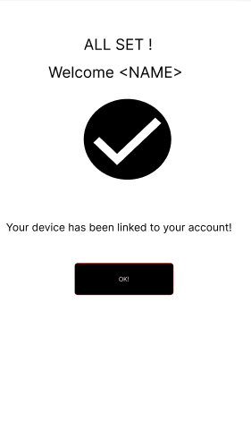

# Smart Insulin Pump App Wireframes Overview

This document outlines the wireframe screens for **Insulinx**, a mobile app designed to support Type 2 diabetes management using a Bluetooth-connected insulin pump/pod. Below is a walkthrough of each wireframe and how they relate with each other.

---

## User Scenario: New User Sets Up App and Monitors Insulin Delivery

### 1. Onboarding & Authentication 🩺

  
  
  

#### `on_Launch`
- Splash screen with branding.
- Options to **Sign In** or **Sign Up**.

#### `sign_Up`
- New user registration form.
- Collects personal info and account credentials.

#### `sign_In`
- Login screen for returning users.

---

### 2. Device Setup Process 🩺

  
  
  

#### `set_Up_One`
- Welcome message and intro to pump setup.

#### `set_Up_Two`
- Bluetooth pairing screen to connect insulin pump.

#### `set_Up_Done`
- Confirmation that device pairing was successful.

---

### 3. Main Dashboard Features 🩺

  
  
  
  
  

#### `Dashboard_Face`
- Primary home dashboard screen.
- Displays summary: insulin data, blood glucose, etc.

#### `Dashboard_Portal`
- Slide-out navigation drawer.
- Access to Pod Status, Notes, Settings, etc.

#### `Dashboard_Pod_Status`
- Shows pump status, delivery rate, and remaining insulin.

#### `Dashboard_Stats`
- Visual graphs of glucose and insulin trends over time.

#### `Dashboard_Notes`
- Allows users to log meals, moods, symptoms, etc.

---

### 4. Error Handling & Notifications 🩺

  
  
  

#### `Dashboard_Error_One`
- Simple error overlay with retry/dismiss options.

#### `Dashboard_Error_Two`
- Detailed error message with troubleshooting steps.

#### `Dashboard_Error_Three`
- Persistent notification-style error alert with link to “Details”.

---
